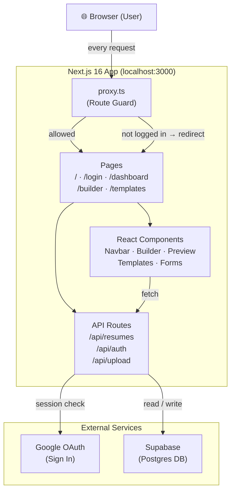
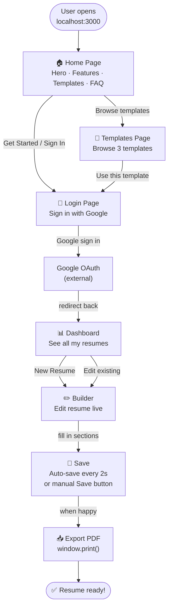
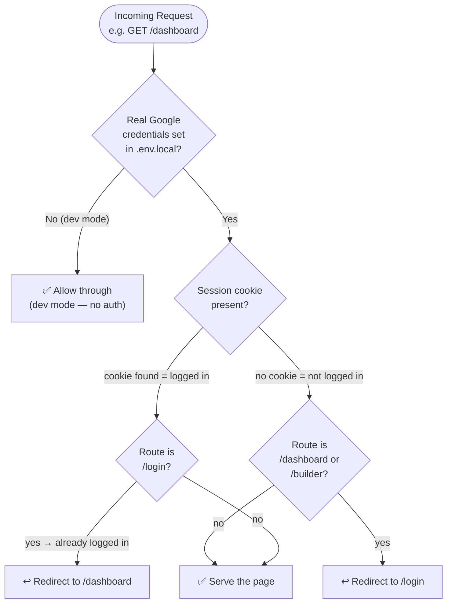
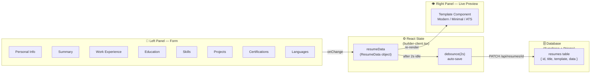
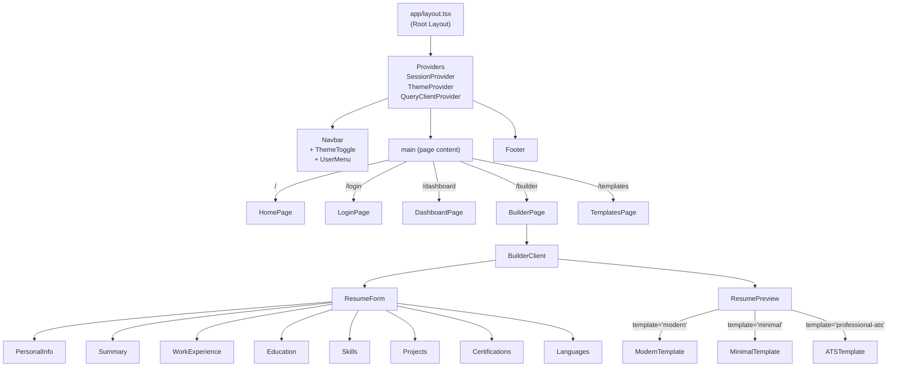
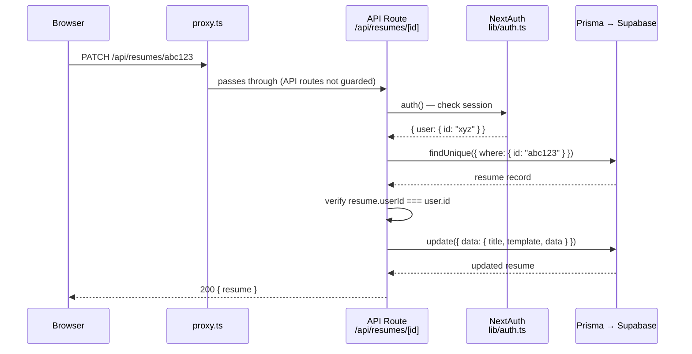
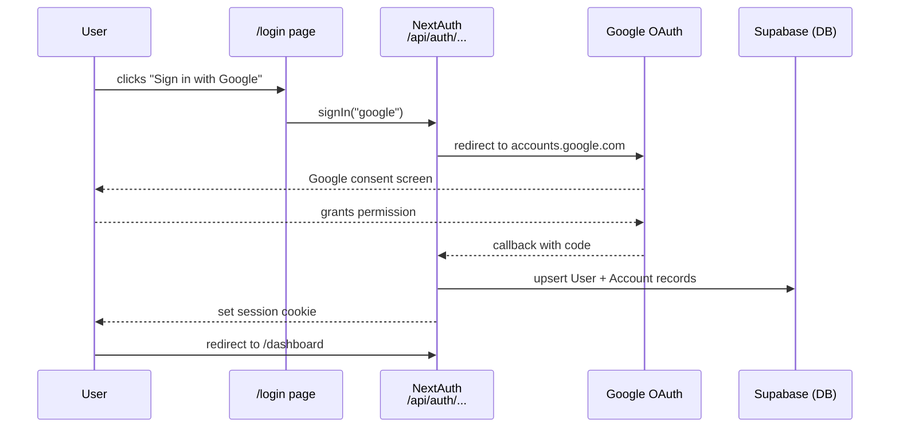

# ResumeForge — How It All Works

A visual breakdown of the app from the browser to the database.

---

## 1 · Big Picture — System Architecture



---

## 2 · User Journey — What a User Does



---

## 3 · Route Guard — How `proxy.ts` Protects Pages



---

## 4 · Builder — Data Flow (Form → Preview → DB)



---

## 5 · Component Tree



---

## 6 · API Request Lifecycle — Saving a Resume



---

## 7 · Auth Flow — Google Sign In



---

## 8 · File Structure Map

```
ResumeForge/
├── proxy.ts               ← Route guard (Next.js 16)
├── app/
│   ├── layout.tsx         ← Root HTML shell + providers
│   ├── page.tsx           ← Home page (/)
│   ├── login/             ← /login
│   ├── dashboard/         ← /dashboard (protected)
│   ├── builder/           ← /builder  (protected)
│   ├── templates/         ← /templates
│   └── api/
│       ├── auth/          ← NextAuth handler
│       ├── resumes/       ← CRUD for resumes
│       └── upload/        ← File upload (stub)
├── components/
│   ├── layout/            ← Navbar, Footer, ThemeToggle
│   ├── home/              ← Hero, Features, FAQ, CTA
│   ├── builder/           ← ResumeForm + all form sections
│   ├── preview/           ← ResumePreview + 3 templates
│   └── providers.tsx      ← Wraps the whole app
├── lib/
│   ├── auth.ts            ← NextAuth config
│   ├── prisma.ts          ← DB client
│   ├── utils.ts           ← cn(), debounce, formatDate
│   └── resume-defaults.ts ← Empty resume starter data
├── hooks/
│   └── use-resumes.ts     ← React Query CRUD hook
├── types/
│   └── resume.ts          ← ResumeData TypeScript types
└── prisma/
    └── schema.prisma      ← DB schema (User, Resume…)
```
